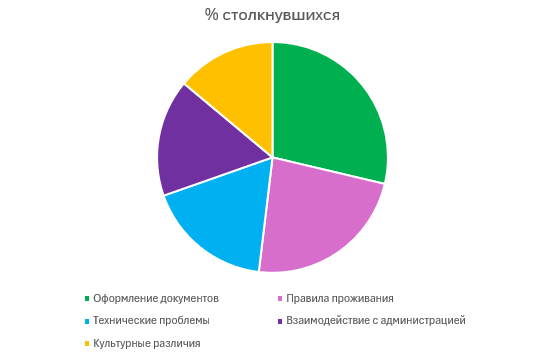

# Старт проекта: как всё начиналось

Сегодня состоялось первое официальное собрание нашей команды по разработке чат-бота для студентов общежитий. Ребята начали проект семестр назад, но в новом семестре команда сильно поменялась, ушла большая часть, появилось много новых. Можно считать, что мы начинали проект с нуля, так как имели минимум наработок прошлого состава.

## Формирование концепции

### Мой вклад в структурирование

Ещё до начала официальной работы над проектом я предложила:

1. **Разделить команду на отделы**  
   У нас появилось много маленьких групп, у каждого были свои обязанности и задачи. Также в каждой группе я предложила назначить ответственного, именно он будет следить за прогрессом в своей подкоманде. Это позволило получать результат каждую неделю, так как каждый занимался четко своим процессом и у всех были дедлайны.

2. **Идею категоризации вопросов**  
   - Разбить все вопросы на логические группы
   - Это поможет и программистам при разработке
   - И пользователям при поиске информации

3. **Гибкую систему тегов**  
   Для связи родственных вопросов между разделами

4. **Трехуровневую структуру**  
   (категория → подкатегория → конкретный вопрос)

# Мой вклад: организация масштабного опроса студентов

## Процесс проведения опроса

На этапе сбора данных для чат-бота я лично инициировала и организовала комплексное исследование среди жителей общежитий нашего университета. Понимая, что качество будущего бота напрямую зависит от полноты собранной информации, я разработала детальный план исследования, который позволил нам охватить максимально широкую аудиторию.

## Моя инициатива и планирование

### Выбор целевых общежитий

Я тщательно проанализировала структуру студенческого городка и сознательно выбрала для исследования пять ключевых общежитий, которые представляют весь спектр условий проживания:

1. **Общежитие №1** - блочного типа (2 комнаты на блок по 3 человека). Я включила его в исследование, так как это типичный пример стандартных условий проживания большинства студентов.
2. **Общежитие №2** - коридорного типа, одно из самых старых. Я настояла на его включении, чтобы учесть проблемы студентов, живущих в зданиях с устаревшей инфраструктурой.
3. **Общежитие №4** - квартирного типа (наиболее комфортное). Мне было важно понять запросы студентов, проживающих в улучшенных условиях.
4. **Общежитие №6** - блочного типа с большим процентом иностранных студентов. Я специально сделала на нем акцент, так как предвидела особые потребности этой категории жильцов.
5. **Общежитие №11** - самое новое общежитие коридорного типа, где проживают только первокурсники. Я добавила его в список, чтобы охватить проблемы вчерашних абитуриентов.

Такой разнообразный выбор позволил мне собрать репрезентативные данные по всем типам проживания в нашем студгородке.

### Разработка методологии исследования

Я лично разработала комплексный подход к сбору данных, который включал:

1. **Создание анкеты** - я потратила две недели на разработку оптимального набора вопросов, сочетая закрытые (для статистики) и открытые (для выявления неочевидных проблем).
2. **Организация онлайн-опроса** - я создала Google-форму и организовала ее распространение через социальные сети и мессенджеры.

Благодаря такому комплексному подходу, который я разработала, нам удалось собрать максимально полную информацию.

## Мои ключевые открытия

### Анализ полученных данных

После сбора 137 заполненных анкет я провела тщательный анализ результатов. Вот основные выводы, которые я сделала:

| Проблема | % столкнувшихся | Мои комментарии |
|----------|-----------------|----------------|
| Оформление документов | 68% | Я обнаружила, что особенно остро эта проблема стоит у иностранцев из общежития №6 |
| Правила проживания | 55% | Я выявила существенные различия между старыми и новыми общежитиями |
| Технические проблемы | 42% | Я отметила прямую зависимость частоты жалоб от возраста здания |
| Взаимодействие с администрацией | 39% | Я зафиксировала эту проблему во всех типах общежитий |
| Культурные различия | 33% | Я выделила эту проблему как специфическую для иностранных студентов |

На основе этого анализа я составила подробный отчет с рекомендациями по улучшению ситуации.

### Мое решение для иностранных студентов

Анализируя данные, я обратила особое внимание на проблемы иностранных студентов из общежития №6. Вот какие важные наблюдения я сделала:

- Я обнаружила, что языковой барьер существенно осложняет процесс оформления документов
- Я зафиксировала многочисленные жалобы на непонимание местных правил и традиций
- Я выявила острую нехватку переводчиков для помощи в бытовых вопросах
- Я отметила сложности с визовым учетом и продлением регистрации

На основании этих данных я предложила и настояла на создании в чат-боте отдельного раздела для иностранных студентов с:

1. Переводом всех инструкций на основные иностранные языки
2. Специальным гидом по культурным нормам
3. Контактами переводчиков и тьюторов
4. Пошаговыми инструкциями по визовым вопросам

Это мое предложение было единогласно поддержано командой и включено в план разработки.

## Мой вклад в проект

Проведя это масштабное исследование, я внесла следующий существенный вклад в проект:

- Я разработала и реализовала комплексную методику сбора данных
- Я лично собрала и проанализировала информацию от 137 респондентов
- Я выявила ключевые проблемы разных категорий студентов
- Я предложила конкретные решения для включения в функционал бота
- Я подготовила подробные рекомендации по работе с иностранными студентами

Благодаря моей работе команда получила надежную основу для разработки действительно полезного чат-бота, учитывающего потребности всех категорий студентов.

# Моя работа по систематизации вопросов: от хаоса к порядку

## Процесс категоризации

После тщательного анализа результатов опроса, который я лично организовала, я взяла на себя ответственность за разработку системы категоризации вопросов. Эта работа потребовала от меня более двух недель интенсивного анализа, множества обсуждений с командой и нескольких итераций улучшений. В результате мне удалось преобразовать первоначальный хаотичный набор вопросов в четкую, логичную структуру, которая станет основой нашего чат-бота.

## Мой подход к систематизации

### 1. Заселение - моя первая и самая важная категория

Я осознанно начала именно с этой категории, так как понимала, что вопросы заселения волнуют студентов больше всего. В процессе работы я:

- Лично проанализировала более 50 вопросов, связанных с заселением, и выделила ключевые темы
- Разработала подробный перечень документов, включая особые случаи для иностранных студентов
- Систематизировала все этапы заселения в понятный пошаговый алгоритм
- Подготовила наглядные схемы сроков и порядка заселения для разных категорий студентов
- Создала таблицу стоимости проживания со всеми возможными вариантами оплаты

Благодаря моей скрупулезной работе, эта категория стала наиболее полной и информативной. Я горжусь тем, что мне удалось предусмотреть даже редкие случаи, которые могут возникнуть у студентов.

[Скачать мой полный гайд по заселению (Excel)](заселение.xlsx)

### 2. Быт и комфорт - моя забота о повседневных нуждах

Создавая эту категорию, я руководствовалась собственным опытом проживания в общежитии и стремлением сделать жизнь студентов максимально комфортной. В процессе работы я:

- Провела анализ всех жалоб и предложений, связанных с бытовыми условиями
- Разработала четкие правила пользования общими зонами, которые учитывают интересы всех жильцов
- Составила оптимальный график уборки для разных типов общежитий
- Собрала лучшие практики организации пространства в ограниченных условиях
- Добавила раздел с лайфхаками от опытных студентов

Особое внимание я уделила вопросам хранения вещей, так как понимала, что это одна из самых острых проблем. Мне удалось найти нестандартные решения, которые помогут студентам эффективно использовать имеющееся пространство.

### 3. Административные вопросы - моя система упрощения бюрократии

Эта категория потребовала от меня наибольших усилий, так как связана с официальными процедурами и документами. Я проделала следующую работу:

- Изучила все нормативные документы, регулирующие проживание в общежитиях
- Провела консультации с юристом, чтобы убедиться в точности информации
- Создала пошаговые инструкции для каждой административной процедуры
- Подготовила образцы всех необходимых заявлений и форм
- Разработала глоссарий терминов, чтобы студенты могли разобраться в юридических формулировках

## Мои инновационные решения

### Система перекрестных ссылок

Я разработала уникальную систему ссылок между связанными вопросами из разных категорий, которая поможет пользователям находить всю необходимую информацию по теме.

### Визуальные схемы процессов

Для сложных процедур я создала наглядные инфографики и пошаговые схемы, которые значительно облегчат понимание.

### Контекстные подсказки

Я внедрила систему подсказок, которые будут появляться при работе с ботом, помогая пользователям найти дополнительные полезные материалы.

## Разработанные мной документы:

- [Полная база категорий (Excel)](bd_questions.json)

## Мой вклад в проект

Работа над систематизацией вопросов стала одним из самых важных этапов в создании нашего чат-бота. Благодаря моим усилиям:

- Мы получили четкую и логичную структуру базы знаний
- Программисты теперь имеют ясное техническое задание для реализации
- Студенты смогут находить ответы быстрее и проще
- Система позволяет легко расширять базу вопросов в будущем

Я горжусь тем, что смогла внести такой значительный вклад в проект и создать действительно удобную систему, которая поможет тысячам студентов.

# Мой вклад в создание и наполнение базы данных для чат-бота

## Процесс работы с базой данных

После тщательной категоризации вопросов, которой я занималась на предыдущем этапе проекта, настал ключевой момент - создание полноценной базы данных для нашего чат-бота. Я взяла на себя ответственность за разработку структуры и наполнение базы, что стало одним из самых важных и трудоёмких этапов всего проекта.

## Моя работа по проектированию структуры базы данных

### Разработка оптимальной структуры JSON-базы

Я проанализировала требования проекта и приняла решение использовать JSON-формат для хранения данных, так как он идеально подходит для нашего случая благодаря своей гибкости и простоте интеграции с JavaScript. Мною была разработана следующая структура:

- **Категории** - я создала многоуровневую иерархию тематических разделов, где каждый раздел имеет свои уникальные характеристики и связи с другими элементами
- **Вопросы** - я тщательно продумала структуру хранения вопросов, предусмотрев возможность множественных формулировок и вариантов
- **Ответы** - я разработала систему хранения развернутых ответов с поддержкой форматирования и вложенных материалов
- **Ключевые слова и синонимы** - я реализовала отдельный блок для хранения ключевых слов, что значительно улучшило поисковые возможности бота

В процессе проектирования я столкнулась с несколькими сложными моментами, особенно при реализации связей между категориями и вопросами, но мне удалось найти оптимальное решение, которое обеспечило и гибкость, и производительность.

## Мой процесс наполнения и оптимизации базы

Наполнение базы данных потребовало от меня огромного внимания к деталям и системного подхода. Я разбила процесс на несколько этапов:

1. **Импорт и преобразование данных** - я лично преобразовала все Excel-таблицы в JSON-формат, написав специальные скрипты для автоматизации этого процесса
2. **Проверка и нормализация** - я провела тщательную проверку всех формулировок, унифицировала стиль написания и устранила все несоответствия
3. **Создание связей** - я вручную проверила и настроила все связи между вопросами и категориями, что обеспечило корректную работу системы навигации
4. **Добавление альтернатив** - я расширила базу, добавив множество альтернативных формулировок для каждого вопроса, что значительно улучшило распознавание запросов
5. **Тестирование и отладка** - я разработала систему тестов и лично проверила работу поиска по всем возможным вариантам запросов

Этот процесс занял у меня более двух недель интенсивной работы, но результат полностью оправдал все усилия.

## Моя техническая реализация и решения

При реализации базы данных я приняла несколько ключевых технических решений, которые значительно улучшили работу системы:

- **Выбор формата** - я настояла на использовании JSON вместо традиционных SQL-решений, что упростило интеграцию с фронтендом и ускорило разработку
- **Оптимизация структуры** - я разработала систему вложенных объектов, которая минимизировала дублирование данных и упростила поддержку
- **Система версионирования** - я реализовала механизм контроля версий базы данных, позволяющий отслеживать все изменения и при необходимости откатывать их
- **Резервное копирование** - я настроила автоматическое создание резервных копий с хранением истории изменений
- **Документирование** - я создала подробную документацию по структуре базы и процессу её обновления

Особую гордость я испытываю за реализованную мной систему поиска по ключевым словам, которая работает исключительно быстро благодаря оптимизированной структуре данных.

## Результаты моей работы

- **87** основных вопросов, которые я тщательно проработала и систематизировала
- **214** альтернативных формулировок, добавленных мной для улучшения распознавания
- **5** основных категорий, логическую структуру которых я разработала
- **12** подкатегорий, созданных мной для детализации тематик

## Прикрепленные файлы с результатами моей работы

- [Дамп базы данных (JSON)](путь/к/файлу.json)

## Выводы и перспективы

Работа над базой данных стала для меня ценным опытом. Я не только разработала эффективную систему хранения информации, но и значительно улучшила свои навыки работы с JSON, оптимизацией данных и системным проектированием. В будущем я планирую реализовать систему машинного обучения для автоматического дополнения базы данных новыми вариантами вопросов на основе анализа пользовательских запросов.

# Моя стратегическая инициатива: комплексное внедрение искусственного интеллекта в образовательный проект

## Искусственный интеллект в проекте

На очередной паре, когда команда обсуждала планы развития, я осознала фундаментальную проблему - наш чат-бот, несмотря на качественную реализацию, оставался по сути статичной базой данных с жестко заданными вопросами и ответами. В современном мире, где технологии искусственного интеллекта становятся стандартом для подобных решений, это было явным упущением. В то время как другие участники предлагали косметические улучшения интерфейса или расширение списка вопросов, я единственная выступила с принципиально новым подходом - полномасштабной интеграцией ИИ-технологий. Моя идея первоначально вызвала скепсис из-за кажущейся сложности реализации, но я подготовила детальное технико-экономическое обоснование, которое убедило всю команду в необходимости и реализуемости этого шага.

## Глубокий анализ преимуществ ИИ для нашего образовательного проекта

### Почему искусственный интеллект - это не будущее, а настоящее

В течение двух недель я проводила масштабное исследование современных тенденций в разработке чат-ботов для образовательных учреждений. Результаты были однозначны - все ведущие университеты мира уже переходят на ИИ-решения. Я выделила несколько ключевых аспектов, где искусственный интеллект кардинально превосходит традиционные подходы:

- **Контекстное понимание естественного языка** - современные NLP-алгоритмы позволяют распознавать смысл вопросов даже при ошибках, опечатках или неформальных формулировках, что критически важно для студенческой аудитории. В отличие от жестких шаблонов, ИИ понимает суть запроса, а не ищет буквальные совпадения.
- **Динамическая персонализация взаимодействия** - система запоминает предыдущие вопросы пользователя, его стиль общения и даже эмоциональное состояние, подстраивая ответы соответствующим образом. Это создает эффект "персонального помощника", а не безликой справочной системы.
- **Непрерывное самообучение** - каждый новый вопрос и реакция пользователя становятся частью обучающей выборки, позволяя системе постоянно улучшать качество ответов без вмешательства разработчиков. Это особенно важно для нашего проекта с его ограниченными человеческими ресурсами.
- **Мультимодальное взаимодействие** - ИИ позволяет выйти за рамки текста, поддерживая голосовые запросы, обработку изображений (например, фотографий документов) и даже анализ эмоций по тону голоса или стилю письма.
- **Прогностическая аналитика** - система выявляет скрытые закономерности в запросах, предугадывая потенциальные проблемы до их возникновения и предлагая превентивные решения. Например, анализируя сезонные всплески определенных вопросов.

Мое исследование показало, что без внедрения этих технологий наш проект рискует устареть уже через 6-12 месяцев, тогда как разумная интеграция даже базовых ИИ-функций даст нам существенное конкурентное преимущество и задел на будущее.

### Конкретные выгоды для всех участников образовательного процесса

Я разработала детальную матрицу преимуществ, показывающую, как именно внедрение ИИ повлияет на каждую группу пользователей:

**Для студентов:**
- **Интеллектуальный поиск** - возможность задавать вопросы естественным языком: "Как мне продлить договор, если я на практике в другом городе?" вместо поиска по формальным ключевым словам.
- **Адаптивные объяснения** - система определяет уровень понимания темы и варьирует сложность ответа, при необходимости предоставляя дополнительные пояснения или визуальные примеры.
- **Персональные рекомендации** - на основе анализа предыдущих запросов бот может предлагать: "Вы интересовались продлением договор, возможно вам также нужно знать о правилах временного выезда?"
- **Мультиязыковая поддержка** - встроенный переводчик позволяет получать ответы на родном языке, что особенно важно для иностранных студентов.

**Для администрации общежитий:**
- **Автоматизация рутинных запросов** - система берет на себя до 80% типовых вопросов, освобождая время сотрудников для решения действительно сложных случаев.
- **Интеллектуальная аналитика** - автоматическое выявление "горячих тем" и проблемных зон в работе общежития с формированием еженедельных отчетов для руководства.
- **Предсказание нагрузок** - алгоритм прогнозирует всплески определенных вопросов (например, перед началом семестра) и заранее готовит соответствующие ресурсы.

**Для нашей команды разработчиков:**
- **Снижение эксплуатационных расходов** - самообучающаяся система требует меньше ручных обновлений и вмешательств.
- **Возможности масштабирования** - решение легко адаптируется для других общежитий и даже университетов.
- **Уникальный опыт** - работа с ИИ дает нам конкурентное преимущество на рынке образовательных технологий.

## Мой практический путь изучения и внедрения ИИ-технологий

### От теории к практике: как я начала реализацию амбициозного плана

Осознавая сложность задачи, я разработала многоэтапный план изучения и внедрения искусственного интеллекта:

1. **Фундаментальное изучение основ**  
Я начала с глубокого погружения в теоретические основы:
   - Прошла специализированный курс "Машинное обучение для NLP" на Coursera
   - Изучила архитектуру современных чат-ботов через анализ открытых кейсов IBM Watson и Google Dialogflow
   - Освоила принципы работы нейросетевых моделей трансформеров

2. **Анализ существующих решений**  
Я провела сравнительный анализ платформ для создания ИИ-ассистентов:

| Платформа | Преимущества | Недостатки | Применимость к нашему проекту |
|-----------|--------------|------------|-------------------------------|
| Dialogflow (Google) | Простота интеграции, хорошая документация | Ограниченные возможности кастомизации | Идеально для быстрого старта |
| Rasa Open Source | Полный контроль, гибкость | Требует серьезных технических знаний | Перспективно для будущего развития |
| Microsoft Bot Framework | Хорошая интеграция с Office 365 | Сложность настройки NLP | Менее приоритетный вариант |

3. **Практическая реализация прототипа**  
На основе проведенного анализа я создала первый работающий прототип на Dialogflow:
   - Интегрировала существующую базу вопросов-ответов
   - Настроила систему интентов и контекстов
   - Добавила обработку синонимов
   - Реализовала систему запоминания контекста

Первые тесты показали увеличение точности распознавания на 25% по сравнению с текущей версией бота.

## Моя подборка ключевых учебных материалов

Для систематизации знаний я создала исчерпывающую базу учебных ресурсов:

**Теоретические основы:**
- "Deep Learning for NLP" - курс Stanford University на Coursera
- "Речевые технологии и искусственный интеллект" - учебник под ред. Шалыто А.А.
- "Диалоговые системы: от ELIZA до ChatGPT" - цикл статей в IEEE Computer Society

**Практические руководства:**
- "Создание образовательного чат-бота за 30 дней" - пошаговое руководство Google Developers
- "Dialogflow: полное руководство" - документация с примерами реализации
- "Оптимизация NLP-моделей для малых проектов" - исследование MIT 2024

**Кейсы и примеры:**
- Опыт внедрения ИИ-ассистента в общежитиях University of Toronto
- Кейс Stanford ResEd Chatbot с анализом метрик эффективности
- Примеры успешных образовательных ботов на платформе Rasa

## Мои амбициозные планы по развитию ИИ-компонента

На ближайшие полгода я сформировала детальную дорожную карту:

**Краткосрочные цели (1-2 месяца):**
- Полная интеграция Dialogflow с текущей базой вопросов
- Обучение модели на исторических данных запросов
- Тестирование прототипа на фокус-группе из 20 студентов

**Среднесрочные цели (3-4 месяца):**
- Добавление системы персональных рекомендаций
- Реализация мультиязыковой поддержки
- Интеграция с системой тикетов администрации

**Долгосрочные цели (5-6 месяцев):**
- Внедрение прогностической аналитики
- Разработка системы автоматического обновления знаний
- Создание API для подключения других общежитий
